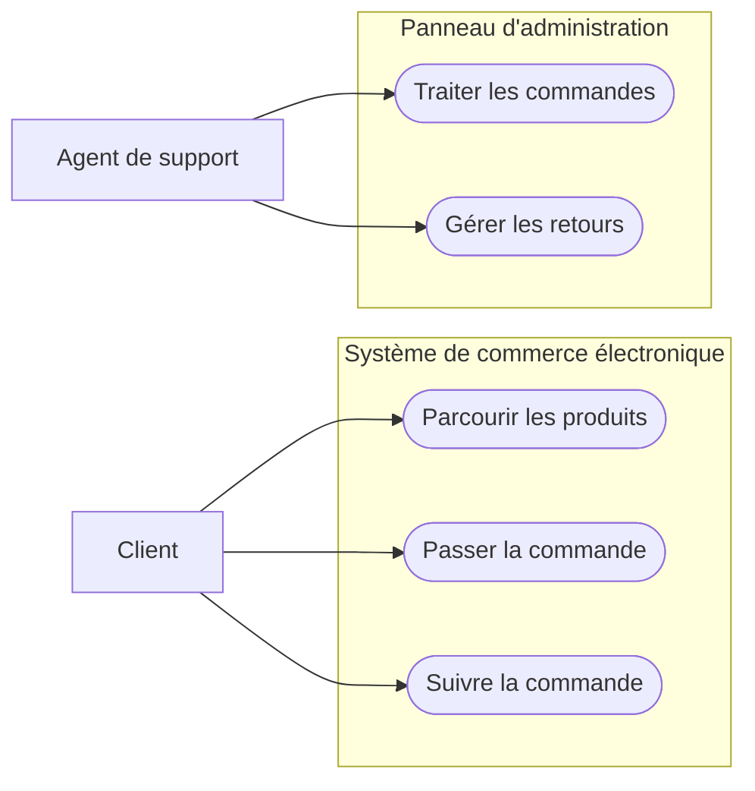

```mermaid
flowchart LR
    subgraph Ecommerce["Système de commerce électronique"]
        A1([Parcourir les produits])
        A2([Passer la commande])
        A3([Suivre la commande])
    end

    subgraph Admin["Panneau d'administration"]
        B1([Traiter les commandes])
        B2([Gérer les retours])
    end

    Client["Client"]
    Agent["Agent de support"]

    Client --> A1
    Client --> A2
    Client --> A3

    Agent --> B1
    Agent --> B2
```