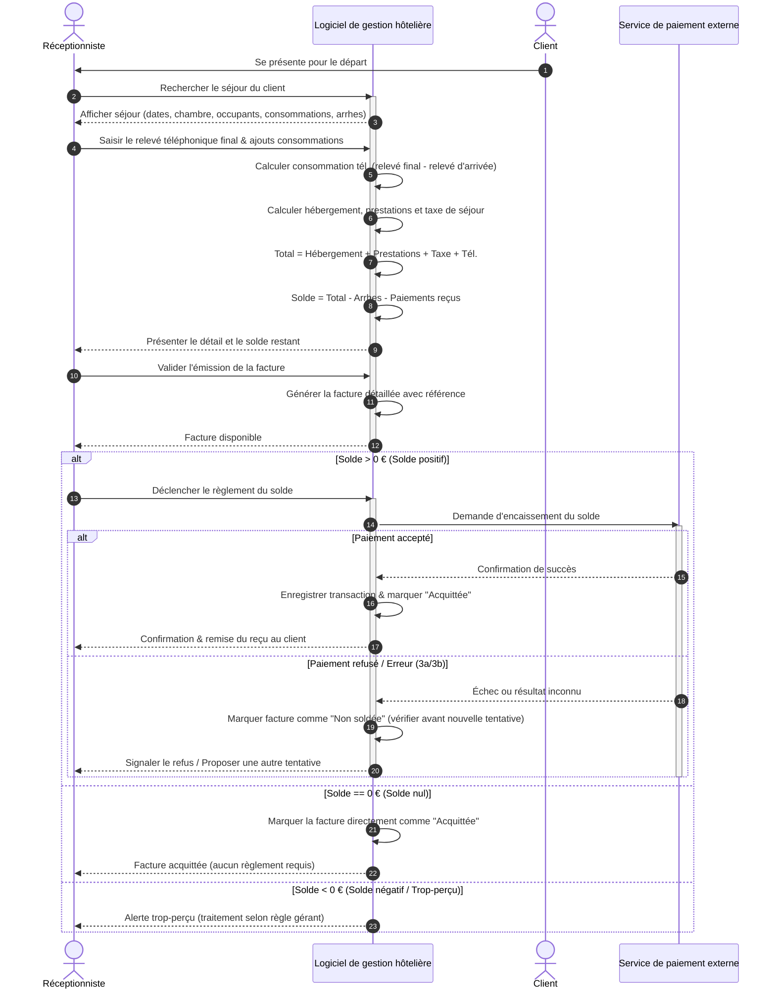

# Diagramme de Séquence - Facturer le Départ

```mermaid
sequenceDiagram
    autonumber
    actor Recep as Réceptionniste
    participant SYS as Logiciel de gestion hôtelière
    actor Client as Client
    participant Paiement as Service de paiement externe

    Client->>Recep: Se présente pour le départ
    Recep->>SYS: Rechercher le séjour du client
    activate SYS
    SYS-->>Recep: Afficher séjour (dates, chambre, occupants, consommations, arrhes)

    Recep->>SYS: Saisir le relevé téléphonique final & ajouts consommations
    SYS->>SYS: Calculer consommation tél. (relevé final - relevé d'arrivée)
    SYS->>SYS: Calculer hébergement, prestations et taxe de séjour
    SYS->>SYS: Total = Hébergement + Prestations + Taxe + Tél.
    SYS->>SYS: Solde = Total - Arrhes - Paiements reçus
    SYS-->>Recep: Présenter le détail et le solde restant

    Recep->>SYS: Valider l'émission de la facture
    SYS->>SYS: Générer la facture détaillée avec référence
    SYS-->>Recep: Facture disponible
    deactivate SYS

    %% Extension : Encaisser un paiement
    alt Solde > 0 € (Solde positif)
        Recep->>SYS: Déclencher le règlement du solde
        activate SYS
        SYS->>Paiement: Demande d'encaissement du solde
        activate Paiement

        alt Paiement accepté
            Paiement-->>SYS: Confirmation de succès
            SYS->>SYS: Enregistrer transaction & marquer "Acquittée"
            SYS-->>Recep: Confirmation & remise du reçu au client
        else Paiement refusé / Erreur (3a/3b)
            Paiement-->>SYS: Échec ou résultat inconnu
            SYS->>SYS: Marquer facture comme "Non soldée" (vérifier avant nouvelle tentative)
            SYS-->>Recep: Signaler le refus / Proposer une autre tentative
        end
        deactivate Paiement
        deactivate SYS

    else Solde == 0 € (Solde nul)
        SYS->>SYS: Marquer la facture directement comme "Acquittée"
        SYS-->>Recep: Facture acquittée (aucun règlement requis)

    else Solde < 0 € (Solde négatif / Trop-perçu)
        SYS-->>Recep: Alerte trop-perçu (traitement selon règle gérant)
    end
```
