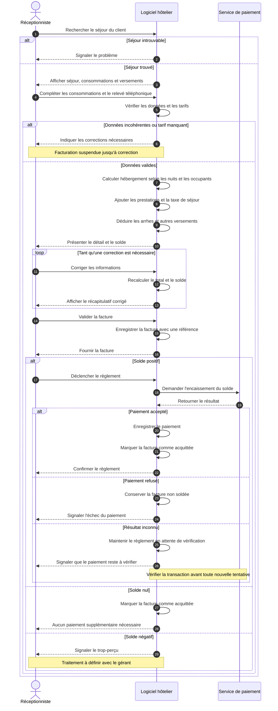

## Diagramme de séquence — Facturer le départ

```mermaid
sequenceDiagram
    autonumber
    actor Receptionniste as Réceptionniste
    participant Systeme as Logiciel hôtelier
    participant Paiement as Service de paiement

    Receptionniste->>Systeme: Rechercher le séjour du client

    alt Séjour introuvable
        Systeme-->>Receptionniste: Signaler le problème
    else Séjour trouvé
        Systeme-->>Receptionniste: Afficher séjour, consommations et versements
        Receptionniste->>Systeme: Compléter les consommations et le relevé téléphonique
        Systeme->>Systeme: Vérifier les données et les tarifs

        alt Données incohérentes ou tarif manquant
            Systeme-->>Receptionniste: Indiquer les corrections nécessaires
            Note over Receptionniste,Systeme: Facturation suspendue jusqu'à correction
        else Données valides
            Systeme->>Systeme: Calculer hébergement selon les nuits et les occupants
            Systeme->>Systeme: Ajouter les prestations et la taxe de séjour
            Systeme->>Systeme: Déduire les arrhes et autres versements
            Systeme-->>Receptionniste: Présenter le détail et le solde

            loop Tant qu'une correction est nécessaire
                Receptionniste->>Systeme: Corriger les informations
                Systeme->>Systeme: Recalculer le total et le solde
                Systeme-->>Receptionniste: Afficher le récapitulatif corrigé
            end

            Receptionniste->>Systeme: Valider la facture
            Systeme->>Systeme: Enregistrer la facture avec une référence
            Systeme-->>Receptionniste: Fournir la facture

            alt Solde positif
                Receptionniste->>Systeme: Déclencher le règlement
                Systeme->>Paiement: Demander l'encaissement du solde
                Paiement-->>Systeme: Retourner le résultat

                alt Paiement accepté
                    Systeme->>Systeme: Enregistrer le paiement
                    Systeme->>Systeme: Marquer la facture comme acquittée
                    Systeme-->>Receptionniste: Confirmer le règlement
                else Paiement refusé
                    Systeme->>Systeme: Conserver la facture non soldée
                    Systeme-->>Receptionniste: Signaler l'échec du paiement
                else Résultat inconnu
                    Systeme->>Systeme: Maintenir le règlement en attente de vérification
                    Systeme-->>Receptionniste: Signaler que le paiement reste à vérifier
                    Note over Systeme,Paiement: Vérifier la transaction avant toute nouvelle tentative
                end

            else Solde nul
                Systeme->>Systeme: Marquer la facture comme acquittée
                Systeme-->>Receptionniste: Aucun paiement supplémentaire nécessaire
            else Solde négatif
                Systeme-->>Receptionniste: Signaler le trop-perçu
                Note over Receptionniste,Systeme: Traitement à définir avec le gérant
            end
        end
    end
```
