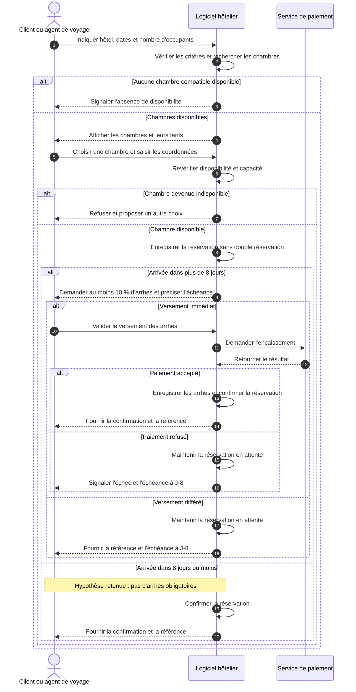

```mermaid
sequenceDiagram
    autonumber
    actor Demandeur as Client ou agent de voyage
    participant Systeme as Logiciel hôtelier
    participant Paiement as Service de paiement

    Demandeur->>Systeme: Indiquer hôtel, dates et nombre d'occupants
    Systeme->>Systeme: Vérifier les critères et rechercher les chambres

    alt Aucune chambre compatible disponible
        Systeme-->>Demandeur: Signaler l'absence de disponibilité
    else Chambres disponibles
        Systeme-->>Demandeur: Afficher les chambres et leurs tarifs
        Demandeur->>Systeme: Choisir une chambre et saisir les coordonnées
        Systeme->>Systeme: Revérifier disponibilité et capacité

        alt Chambre devenue indisponible
            Systeme-->>Demandeur: Refuser et proposer un autre choix
        else Chambre disponible
            Systeme->>Systeme: Enregistrer la réservation sans double réservation

            alt Arrivée dans plus de 8 jours
                Systeme-->>Demandeur: Demander au moins 10 % d'arrhes et préciser l'échéance

                alt Versement immédiat
                    Demandeur->>Systeme: Valider le versement des arrhes
                    Systeme->>Paiement: Demander l'encaissement
                    Paiement-->>Systeme: Retourner le résultat

                    alt Paiement accepté
                        Systeme->>Systeme: Enregistrer les arrhes et confirmer la réservation
                        Systeme-->>Demandeur: Fournir la confirmation et la référence
                    else Paiement refusé
                        Systeme->>Systeme: Maintenir la réservation en attente
                        Systeme-->>Demandeur: Signaler l'échec et l'échéance à J-8
                    end
                else Versement différé
                    Systeme->>Systeme: Maintenir la réservation en attente
                    Systeme-->>Demandeur: Fournir la référence et l'échéance à J-8
                end

            else Arrivée dans 8 jours ou moins
                Note over Demandeur,Systeme: Hypothèse retenue : pas d'arrhes obligatoires
                Systeme->>Systeme: Confirmer la réservation
                Systeme-->>Demandeur: Fournir la confirmation et la référence
            end
        end
    end
```
